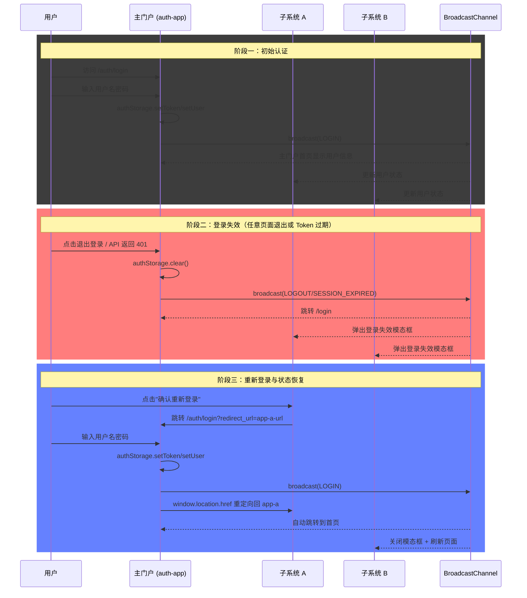

# UniPortal - 多 Vue 项目统一用户认证与状态同步方案

基于 Monorepo 架构的多 Vue 3 应用统一认证解决方案，实现跨应用、跨页面的实时用户状态同步。

## ✨ 核心特性

- **统一认证入口**：集中的认证中心处理登录、登出、Token 管理
- **实时状态同步**：通过 BroadcastChannel 实现跨应用/跨标签页的实时状态同步
- **安全兜底机制**：Axios 拦截器统一处理 401，确保安全性不依赖前端同步
- **Monorepo 管理**：使用 pnpm workspace 统一管理多个项目
- **代码复用**：共享工具包封装认证逻辑，避免重复实现
- **样式统一**：全项目采用 Sass (SCSS) 样式预处理器，支持变量、嵌套、混合宏等特性
- **GitHub Pages 支持**：一键部署到 GitHub Pages，支持自定义域名和子路径部署
- **SPA History 模式**：通过根目录 404.html 实现 GitHub Pages 下的单页应用路由

## 📁 项目结构

```
UniPortal/
├── apps/                      # 应用目录
│   ├── auth-app/              # 认证中心
│   │   ├── src/
│   │   │   ├── router/        # 路由配置
│   │   │   ├── views/         # 页面组件
│   │   │   │   ├── Index.vue  # 主门户首页
│   │   │   │   └── Login.vue  # 登录页面
│   │   │   ├── App.vue        # 根组件（模态框处理）
│   │   │   ├── main.ts
│   │   │   └── style.css
│   │   ├── .env               # 环境变量
│   │   ├── index.html
│   │   ├── package.json
│   │   ├── tsconfig.json
│   │   └── vite.config.ts
│   ├── business-app-a/        # 业务应用 A
│   └── business-app-b/        # 业务应用 B
├── packages/
│   └── shared/                # 共享工具包
│       ├── src/
│       │   ├── auth/
│       │   │   ├── types.ts           # 用户信息、认证事件类型
│       │   │   ├── storage.ts         # localStorage 操作封装
│       │   │   ├── channel.ts         # BroadcastChannel 封装（支持多页签）
│       │   │   └── redirect.ts        # 重定向参数处理
│       │   ├── http/
│       │   │   ├── index.ts           # Axios 实例
│       │   │   └── interceptors.ts    # 请求/响应拦截器
│       │   ├── env.d.ts               # 环境变量类型声明
│       │   └── index.ts               # 统一导出
│       ├── package.json
│       └── tsconfig.json
├── docs/                      # 文档目录
│   └── test-cases.md          # 测试用例文档
├── scripts/
│   ├── deploy.js              # 一键部署脚本
│   └── nginx.conf.example     # Nginx 配置示例
├── .gitignore
├── package.json
├── pnpm-lock.yaml
├── pnpm-workspace.yaml
└── tsconfig.json
```

## 🚀 快速开始

### 环境要求

- Node.js >= 18.0.0
- pnpm >= 8.0.0

### 安装依赖

```bash
pnpm install
```

### 开发模式

使用 `concurrently` 并行启动所有应用：

```bash
pnpm dev
```

### 开发环境访问地址

| 应用 | 地址 |
|------|------|
| 认证中心 | http://127.0.0.1:3001/auth/ |
| 业务应用 A | http://127.0.0.1:3002/app-a/ |
| 业务应用 B | http://127.0.0.1:3003/app-b/ |

### 构建

```bash
# 构建所有应用
pnpm build
```

### 部署

```bash
# 一键部署所有应用
pnpm deploy

# 部署单个应用
pnpm deploy:auth
```

## 🔄 状态同步机制

### 认证流程总览



### 通信方式

1. **首选方案**：BroadcastChannel API，实现同源页面间的实时消息广播
2. **降级方案**：localStorage + storage 事件

### 多页签标识

每个页签拥有唯一的 senderId（格式：`{appPrefix}_{timestamp}_{random}`），确保同一应用的多个页签之间也能正确通信。

### 认证事件类型

| 事件 | 触发场景 | 处理行为 |
|------|----------|----------|
| `LOGIN` | 用户登录成功 | 更新用户信息、关闭登录模态框、跳转首页 |
| `LOGOUT` | 用户主动登出 | 清除状态、显示模态框或跳转登录页 |
| `SESSION_EXPIRED` | Token 过期或失效 | 清除状态、显示模态框、跳转登录页 |
| `FORCE_LOGOUT` | 管理员强制下线 | 清除状态、显示模态框、跳转登录页 |
| `USER_CHANGED` | 用户信息变更 | 更新用户信息显示 |

### 安全兜底

所有应用的 Axios 实例配置了统一的响应拦截器，当 API 请求返回 401 状态码时：

1. 清除本地用户状态
2. 广播 `SESSION_EXPIRED` 事件
3. 自动跳转到认证中心登录页

## 🔗 重定向机制

### 参数规范

| 参数 | 使用场景 | 值类型 | 示例 |
|------|----------|--------|------|
| `return_to` | 主门户内部重定向 | 相对路径 | `/` |
| `redirect_url` | 子系统重定向 | 完整 URL | `http://127.0.0.1:3002/app-a/` |

### 登录后重定向逻辑

```
Login.vue 解析重定向参数
    ↓
有 redirect_url → window.location.href 跳转
    ↓
有 return_to → router.push 路由跳转
    ↓
无参数 → 默认跳转到 /
```

### 路由守卫重定向

主门户路由守卫检测到未认证访问时，自动携带 `return_to` 参数：

```typescript
router.beforeEach((to, _from, next) => {
  if (to.meta.requiresAuth && !isAuthenticated) {
    next({ 
      path: '/login', 
      query: { return_to: to.fullPath } 
    });
  }
});
```

## 🎨 样式规范

全项目采用 **Sass (SCSS)** 样式预处理器，统一使用 `<style lang="scss" scoped>` 标签。

### 样式特性

- **变量定义**：颜色、阴影、圆角等提取为变量
- **嵌套规则**：CSS 选择器嵌套，减少重复代码
- **混合宏**：可复用的样式片段

### 示例

```scss
$primary-gradient: linear-gradient(135deg, #667eea 0%, #764ba2 100%);
$text-primary: #1a1a2e;
$radius-md: 8px;

.login-container {
  display: flex;
  justify-content: center;
  align-items: center;
  
  .login-box {
    background: white;
    border-radius: $radius-md;
    padding: 40px;
    
    .login-title {
      color: $text-primary;
      font-size: 28px;
    }
  }
}
```

## ⚙️ 环境变量

各应用的 `.env` 文件可配置：

```bash
# API 基础地址
VITE_API_URL=/api

# 认证中心登录页地址
VITE_AUTH_URL=/auth/login

# 应用基础路径（由部署脚本自动注入）
VITE_BASE_PATH=/auth/

# 仓库名（由部署脚本自动注入，用于子路径部署）
VITE_REPO_NAME=UniPortal
```

| 变量 | 说明 | 示例 |
|------|------|------|
| `VITE_API_URL` | API 请求基础地址 | `/api` |
| `VITE_AUTH_URL` | 认证中心登录页地址 | `/auth/login` |
| `VITE_BASE_PATH` | 应用基础路径 | `/auth/`, `/app-a/` |
| `VITE_REPO_NAME` | GitHub 仓库名，用于子路径构建 | `UniPortal` |

## 📦 共享包使用

在业务应用中引用共享包：

```typescript
import { 
  authStorage, 
  authChannel, 
  AuthAction,
  http,
  buildLoginUrl,
  parseRedirectParams
} from '@my-monorepo/shared';

// 读取用户状态
const state = authStorage.getState();

// 监听认证事件
authChannel.onMessage((msg) => {
  if (msg.action === AuthAction.LOGOUT) {
    authStorage.clear();
    // 跳转到登录页
  }
});

// 发起 API 请求（自动携带 Token）
http.get('/api/user/profile');

// 构建登录 URL（子系统使用）
const loginUrl = buildLoginUrl(window.location.href);

// 解析重定向参数
const { redirectUrl, returnTo } = parseRedirectParams();
```

## 📝 Nginx 配置示例

生产环境部署时，将所有应用放在同一域名下不同路径：

```nginx
server {
    listen 80;
    server_name domain.com;

    location /auth/ {
        alias /var/www/html/auth/;
        try_files $uri $uri/ /auth/index.html;
    }

    location /app-a/ {
        alias /var/www/html/app-a/;
        try_files $uri $uri/ /app-a/index.html;
    }

    location /app-b/ {
        alias /var/www/html/app-b/;
        try_files $uri $uri/ /app-b/index.html;
    }

    location = / {
        return 302 /auth/login;
    }
}
```

## 🚀 GitHub Pages 部署

### 环境变量配置

| 变量 | 说明 | 默认值 |
|------|------|--------|
| `REPO_NAME` | GitHub 仓库名，用于构建子路径（如 `/UniPortal`） | 空（根路径部署） |
| `CUSTOM_DOMAIN` | 自定义域名（可选） | 空 |

### CI/CD 配置

项目已配置 GitHub Actions 自动部署，修改 `.github/workflows/deploy.yml`：

```yaml
env:
  REPO_NAME: ${{ github.event.repository.name }}
  # CUSTOM_DOMAIN: your-domain.com  # 如有自定义域名取消注释
```

### 手动部署

```bash
# 设置仓库名（子路径部署）
REPO_NAME=UniPortal pnpm deploy

# 根路径部署（域名根目录）
pnpm deploy
```

### SPA History 模式支持

GitHub Pages 默认不支持 SPA history 模式，项目通过根目录 `404.html` 实现路由重定向：

1. 访问 `/UniPortal/auth/login?redirect_url=xxx` 时返回 404
2. `404.html` 将完整 URL 存入 `sessionStorage`
3. 重定向到应用根路径 `/UniPortal/auth/`
4. 应用加载后读取 `sessionStorage` 并 `router.replace` 到目标路由

### 部署路径结构

```
dist/
├── auth/           # 认证中心
├── app-a/          # 业务应用 A
├── app-b/          # 业务应用 B
├── 404.html        # SPA 路由重定向页面
└── index.html      # 根路径重定向到认证中心
```

## 📖 测试场景

详细测试用例请参考 [docs/test-cases.md](./docs/test-cases.md)

## 📚 文档

- [快速部署手册](./docs/deployment-guide.md)
- [多系统用户同步方案移植指南](./docs/migration-guide.md)

## 📄 许可证

MIT License
